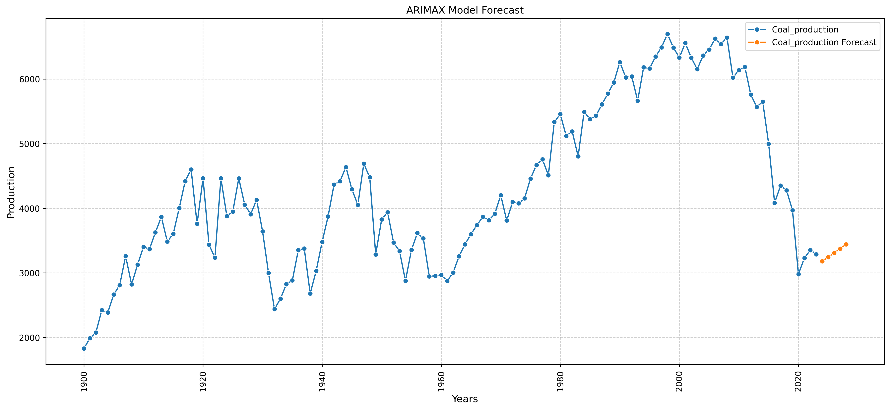
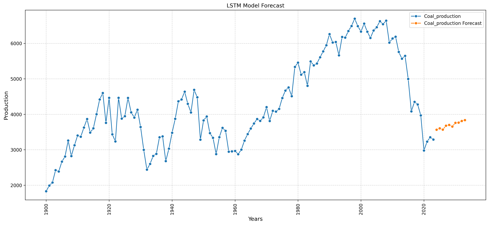

# Time Series Predictions on Energy Production

[](https://colab.research.google.com/github/theophile-bb/Time-series-predictions-on-energy-production/blob/main/notebooks/energy_forecasting.ipynb)

Time Series Forecasting models and experiments to predict energy production over time. This project explores multiple modeling approaches including ARIMA, Prophet, LSTM, and AutoML time series predictor (Chronos), organized into reusable code and structured notebooks for reproducibility.


---

##  Project Structure

Time-series-predictions-on-energy-production/ <br>
├── data/ <br>
│ ├── raw_sample.csv # Small sample dataset <br>
├── src/ <br>
│ ├── init.py <br>
│ └── utils.py # Reusable functions for data & model <br>
├── plots/ # Saved visualizations <br>
├── energy_forecasting.ipynb # Main analysis notebook <br>
├── requirements.txt <br>
├── .gitignore <br>
└── README.md <br>

---

## 📋 Prerequisites

This project requires:

- Python 3.10+
- A working Python environment (venv, conda, etc.)

---

## ⚙️ Installation

Clone the repository and install dependencies:

```
$ git clone https://github.com/theophile-bb/Time-series-predictions-on-energy-production.git
$ cd Time-series-predictions-on-energy-production
$ pip install -r requirements.txt
```


## Getting the data

Dataset : https://github.com/owid/energy-data?tab=readme-ov-file

The dataset is very complete, especially regarding the long running energies such as oil, gas or coal. It contains a lot of observations related to the energy production and consumption in different countries and different years.
The repository contains a small sample dataset for quick testing.

For larger datasets:

Place your data in data/

Use functions in src/utils.py to load and process it


## Notebook

The main analysis is in: energy_forecasting.ipynb


It includes:

- Data loading & cleaning

- Preprocessing & Exploratory analysis

- Model training and evaluation

  - ARIMA / SARIMAX

  - Prophet

  - LSTM

  - Chronos / AutoML

- Forecast visualizations

- Performance comparison


## Visualizations

Example of visualizations made :

*Evolution of the 3 main energy production means over the years*


*ARIMAX*


*Prophet*


*LSTM*


*Chronos*


